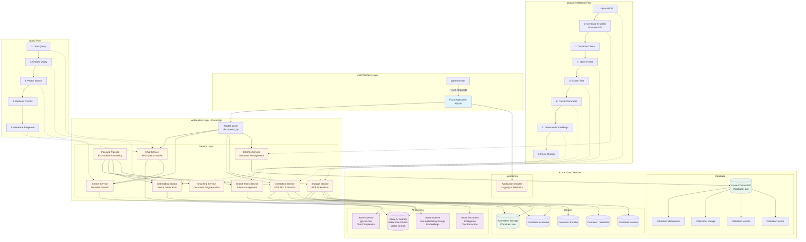

```mermaid
graph TB
    subgraph "User Interface Layer"
        UI[Web Browser]
        UI --> |HTMX Requests| Flask
    end

    subgraph "Application Layer - Flask App"
        Flask[Flask Application<br/>app.py]
        Routes[Routes Layer<br/>documents_bp]
        Flask --> Routes
        
        subgraph "Service Layer"
            ChatSvc[Chat Service<br/>RAG Query Handler]
            SearchSvc[Search Service<br/>Semantic Search]
            ExtractSvc[Extraction Service<br/>PDF Text Extraction]
            ChunkSvc[Chunking Service<br/>Document Segmentation]
            EmbedSvc[Embedding Service<br/>Vector Generation]
            IndexPipe[Indexing Pipeline<br/>End-to-End Processing]
            SearchIdxSvc[Search Index Service<br/>Index Management]
            StorageSvc[Storage Service<br/>Blob Operations]
            CosmosSvc[Cosmos Service<br/>Metadata Management]
        end
        
        Routes --> ChatSvc
        Routes --> SearchSvc
        Routes --> ExtractSvc
        Routes --> StorageSvc
        Routes --> CosmosSvc
        
        IndexPipe --> ExtractSvc
        IndexPipe --> ChunkSvc
        IndexPipe --> EmbedSvc
        IndexPipe --> SearchIdxSvc
    end

    subgraph "Azure Cloud Services"
        subgraph "Storage"
            BlobRaw[(Azure Blob Storage<br/>Container: raw)]
            BlobExtracted[(Container: extracted)]
            BlobThumbs[(Container: thumbs)]
            BlobManifests[(Container: manifests)]
            BlobArchive[(Container: archive)]
        end
        
        subgraph "Database"
            Cosmos[(Azure Cosmos DB<br/>Database: ipar)]
            CosmosDoc[Collection: documents]
            CosmosLineage[Collection: lineage]
            CosmosEvents[Collection: events]
            CosmosUsers[Collection: users]
            Cosmos --> CosmosDoc
            Cosmos --> CosmosLineage
            Cosmos --> CosmosEvents
            Cosmos --> CosmosUsers
        end
        
        subgraph "AI Services"
            DocIntel[Azure Document<br/>Intelligence<br/>Text Extraction]
            OpenAIEmbed[Azure OpenAI<br/>text-embedding-3-large<br/>Embeddings]
            OpenAIChat[Azure OpenAI<br/>gpt-4o-mini<br/>Chat Completions]
            AISearch[(Azure AI Search<br/>Index: ipar-chunks<br/>Vector Search)]
        end
        
        subgraph "Monitoring"
            AppInsights[Application Insights<br/>Logging & Telemetry]
        end
    end

    subgraph "Document Upload Flow"
        Upload[1. Upload PDF]
        Hash[2. Generate SHA256<br/>Document ID]
        DupCheck[3. Duplicate Check]
        Store[4. Store in Blob]
        Extract[5. Extract Text]
        Chunk[6. Chunk Document]
        Embed[7. Generate Embeddings]
        Index[8. Index Chunks]
        
        Upload --> Hash
        Hash --> DupCheck
        DupCheck --> Store
        Store --> Extract
        Extract --> Chunk
        Chunk --> Embed
        Embed --> Index
    end

    subgraph "Query Flow"
        Query[1. User Query]
        QueryEmbed[2. Embed Query]
        VectorSearch[3. Vector Search]
        Retrieve[4. Retrieve Chunks]
        Generate[5. Generate Response]
        
        Query --> QueryEmbed
        QueryEmbed --> VectorSearch
        VectorSearch --> Retrieve
        Retrieve --> Generate
    end

    %% Service to Azure connections
    StorageSvc --> BlobRaw
    StorageSvc --> BlobExtracted
    StorageSvc --> BlobThumbs
    StorageSvc --> BlobManifests
    StorageSvc --> BlobArchive
    
    CosmosSvc --> Cosmos
    
    ExtractSvc --> DocIntel
    ExtractSvc --> BlobRaw
    ExtractSvc --> BlobExtracted
    
    EmbedSvc --> OpenAIEmbed
    
    ChatSvc --> OpenAIChat
    ChatSvc --> SearchSvc
    
    SearchSvc --> AISearch
    SearchIdxSvc --> AISearch
    
    Flask --> AppInsights

    %% Flow connections
    Upload -.-> StorageSvc
    Hash -.-> CosmosSvc
    Store -.-> StorageSvc
    Extract -.-> ExtractSvc
    Chunk -.-> ChunkSvc
    Embed -.-> EmbedSvc
    Index -.-> SearchIdxSvc
    
    Query -.-> ChatSvc
    QueryEmbed -.-> EmbedSvc
    VectorSearch -.-> SearchSvc
    Generate -.-> ChatSvc

    style Flask fill:#e1f5ff
    style ChatSvc fill:#fff4e1
    style SearchSvc fill:#fff4e1
    style ExtractSvc fill:#fff4e1
    style ChunkSvc fill:#fff4e1
    style EmbedSvc fill:#fff4e1
    style IndexPipe fill:#fff4e1
    style SearchIdxSvc fill:#fff4e1
    style StorageSvc fill:#fff4e1
    style CosmosSvc fill:#fff4e1
    
    style BlobRaw fill:#e8f5e9
    style Cosmos fill:#e8f5e9
    style DocIntel fill:#f3e5f5
    style OpenAIEmbed fill:#f3e5f5
    style OpenAIChat fill:#f3e5f5
    style AISearch fill:#f3e5f5
    style AppInsights fill:#fff3e0
```